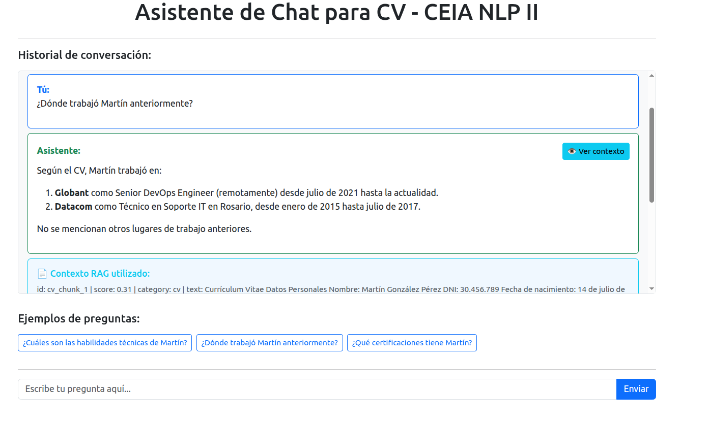
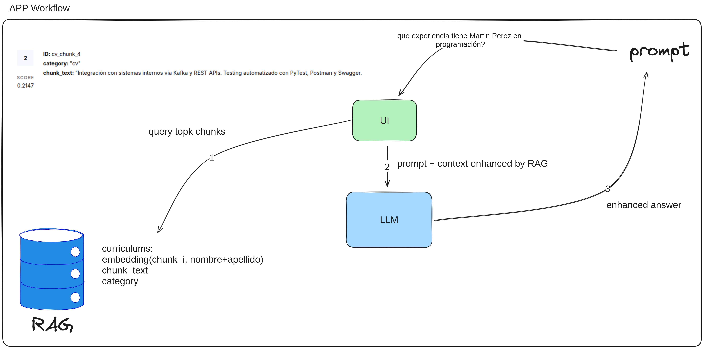
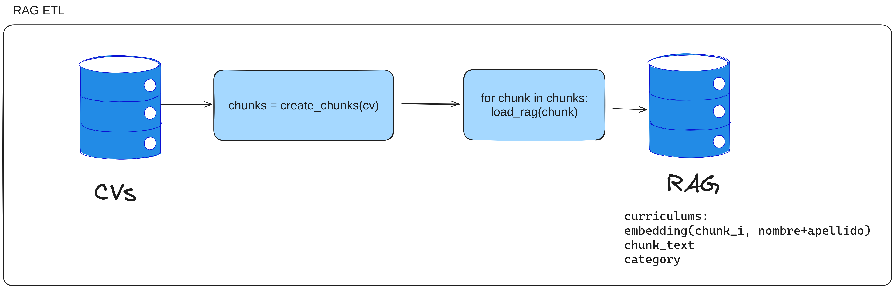

# CV Chatbot - RAG System

Sistema de generación de texto (chatbot) que utiliza la técnica de **Retrieval-Augmented Generation (RAG)** para responder consultas sobre currículums vitae. El chatbot es capaz de recuperar información de una base de datos vectorial y usarla para generar respuestas más completas y precisas.



## Tabla de Contenidos

- [Características](#características)
- [Pipelines](#pipelines)
- [Tecnologías Utilizadas](#tecnologías-utilizadas)
- [Prerrequisitos](#prerrequisitos)
- [Getting Started](#getting-started)
  - [1. Clonar el repositorio](#1-clonar-el-repositorio)
  - [2. Configurar variables de entorno](#2-configurar-variables-de-entorno)
  - [3. Instalar dependencias](#3-instalar-dependencias)
  - [4. Ejecutar la aplicación](#4-ejecutar-la-aplicación)
- [Estructura del Proyecto](#estructura-del-proyecto)
- [Uso](#uso)
- [Comandos Disponibles](#comandos-disponibles)
- [Consigna Original](#consigna-original)
- [Contribución](#contribución)
- [Contacto](#contacto)

## Características

- Interfaz web desarrollada con Dash y Bootstrap
- Sistema RAG implementado con Pinecone y embeddings
- Modelo de lenguaje integrado con Groq
- Búsqueda semántica para recuperar contexto relevante
- Respuestas optimizadas para análisis de CVs
- Visualización del contexto usado para generar cada respuesta

## Pipelines

El flujo principal del chat inicia cuando el usuario envía una consulta a través de la interfaz web. La aplicación procesa la pregunta y utiliza técnicas de búsqueda semántica para identificar los fragmentos de contexto más relevantes almacenados en la base de datos vectorial **Pinecone**. Estos fragmentos (*contexto*) se combinan y se envían junto con la consulta original al modelo de lenguaje integrado con **Groq**, que genera una respuesta optimizada. El historial de las preguntas y respuestas se mantiene en una lista que hace de gestion de memoria. Finalmente, la respuesta y el contexto utilizado se muestran al usuario.




El proceso de carga comienza con la segmentación (*chunking*) del currículum vitae en fragmentos de texto más pequeños y manejables. Cada fragmento es procesado para obtener su representación vectorial mediante un modelo de embeddings. Estos vectores, junto con metadatos relevantes, se almacenan en la base de datos vectorial (**Pinecone**). El chunking se realiza con la libreria Natural Language Toolkit (NLTK).



## Tecnologías Utilizadas

- Python 3.13
- Dash - Framework web para la interfaz
- Pinecone - Base de datos vectorial
- Groq - API de modelos de lenguaje
- NLTK - Procesamiento de texto
- UV - Gestor de dependencias

## Prerrequisitos

Antes de comenzar, asegúrate de tener:

1. Python 3.10+ instalado
2. UV package manager ([instalación](https://docs.astral.sh/uv/getting-started/installation/))
3. Cuenta de Pinecone (plan Starter gratuito)
4. Cuenta de Groq para acceso a la API
5. Variables de entorno configuradas:
   ```bash
   PINECONE_API_KEY=tu_api_key_de_pinecone
   GROQ_API_KEY=tu_api_key_de_groq
   ```

## Getting Started

### 1. Clonar el repositorio

```bash
git clone https://github.com/tu-usuario/ceia-nlp-II-tp-2.git
cd ceia-nlp-II-tp-2
```

### 2. Configurar variables de entorno

Crea un archivo `.env` en la raíz del proyecto:

```bash
# .env
PINECONE_API_KEY=tu_api_key_aqui
GROQ_API_KEY=tu_api_key_aqui
```

### 3. Instalar dependencias

```bash
make install
```

### 4. Ejecutar la aplicación

#### Interfaz Web (recomendado)
```bash
make load # cargamos datos en vector db de no haberlo hecho
make ui
```
La aplicación estará disponible en: http://localhost:8050

#### Interfaz de línea de comandos
```bash
make run
```

## Uso

### Interfaz Web
1. Abre http://localhost:8050 en tu navegador
2. Utiliza los ejemplos de preguntas o escribe tu propia consulta
3. Haz clic en "Ver contexto" para ver el contexto RAG utilizado

### Ejemplos de Preguntas
- "¿Cuáles son las habilidades técnicas de Martín?"
- "¿Dónde trabajó Martín anteriormente?"
- "¿Qué certificaciones tiene Martín?"

## Comandos Disponibles

```bash
make install    # Instalar dependencias
make ui        # Ejecutar interfaz web
make run       # Ejecutar interfaz CLI
make load      # Carga de datos en VectorDB
```

## Consigna Original

**TP2 - Procesamiento de Lenguaje Natural 2**  
*Carrera de Especialización en Inteligencia Artificial*

### Objetivos
• Implementar un sistema de generación de texto (chatbot) que utilice la técnica de Retrieval-Augmented Generation (RAG)  
• El chatbot debe ser capaz de recuperar información de una base de datos y usarla para generar respuestas más completas  
• Mejorar la calidad de las respuestas generadas mediante contexto relevante  

### Entregables
• Link a repositorio público  
• Captura de video del chatbot consultando el CV del alumno  
• Se evalúa el código y la presentación (Repo con documentación)  
